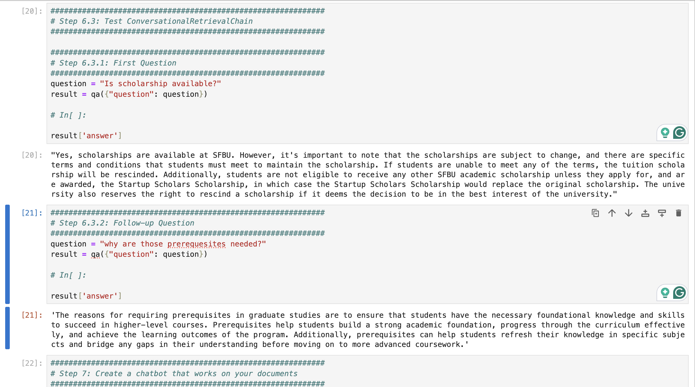

# LangChain Customer Support System

 This repository contains a project that demonstrates how to build a **Customer Support System** using **LangChain** and **ChatGPT**. The system leverages **Retrieval Augmented Generation (RAG)** to answer questions based on data from various document types, such as PDFs, YouTube videos, and URLs.

---

## Introduction

This project aims to create a chatbot capable of answering customer support questions using documents from multiple formats. The system combines **LangChain**'s powerful tools with **OpenAI's GPT models** to efficiently retrieve and process information.

---

## Design

### Problem Identification
Managing and retrieving relevant information from large and diverse datasets (PDFs, YouTube videos, URLs) presents significant challenges, including:
- Efficient document loading and storage.
- Accurate retrieval of contextually relevant information.

### Solution Investigation
To solve these problems, the following technologies were considered:
- **Vectorstores and Embeddings**: Transforming text into numerical vectors for similarity-based retrieval.
- **RAG Workflow**: Using document retrieval and embeddings for context-driven question answering.

### Solution Selection
The system implements:
1. **RetrievalQA Chain**: For precise question-answering with contextual data.
2. **ConversationalRetrievalChain**: Adds memory to enable multi-turn conversations with consistent context.

---

## Implementation

### Workflow Steps:
1. **Document Loading**: Load documents (PDFs, URLs, YouTube videos).
2. **Content Splitting**: Split data into smaller, semantically meaningful chunks.
3. **Embedding and Indexing**: Convert chunks into embeddings and store in a vector database.
4. **Vectorstore Storage**: Use Chroma for efficient similarity search.
5. **Retrieval**: Search and retrieve relevant chunks based on user queries.
6. **Conversational AI**: Implement conversational memory to handle follow-up queries.

---

## Testing

### Test Plan:
- Validate the system's ability to retrieve relevant answers.
- Test conversational memory with follow-up questions.
- Sample Queries:
    - **"Is scholarship available?"**
    - **"Why are those prerequesites needed?"**

### Results:
- Ensured accurate responses and context-aware follow-ups.

## Screenshot of execution results




---

## Conclusion

This project successfully demonstrates how to build a robust, document-driven chatbot using **LangChain** and **ChatGPT**. The system serves as a foundation for more complex, data-driven conversational applications.

---

## How to Run the Project

1. Clone this repository:
   ```bash
   git clone https://github.com/JTasnim/LangChainChat.git

## To learn more

[Google Slide](/assets/LangChainChatWithData.pptx)
